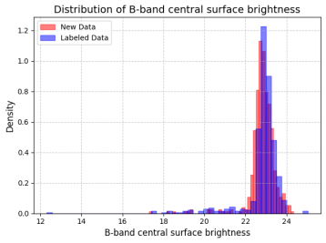
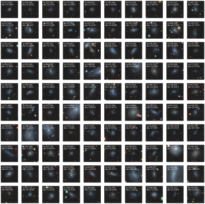

# Multi_model_galaxy_classfication

本项目旨在利用多种深度学习模型对星系进行分类,减少误检率。我们选择了Vision Transformer (ViT) 系列中的ViT-tiny、ViT-small和ViT-base，Swin Transformer系列中的Swin-tiny、Swin-small和Swin-base，以及ResNet系列的ResNet-18、ResNet-50和ResNet-101作为基模型。所有模型均加载了基于ImageNet-1K数据集预训练的权重以初始化网络参数。随后，从目标数据集中随机选取80%的数据用于每个模型的微调训练，而保留剩余的20%数据作为测试集来评估模型性能。最终结果是通过集成学习中的投票机制得出，即每个基模型对测试样本进行预测后，根据投票结果决定最终预测结果。

# 以低表面亮度星系为例

**数据集制作**：

   - 图像数据：从[DESI DR10](https://www.legacysurvey.org/dr10/)下载所需的fits图像数据。
   - 星表数据：[Du.2015](https://arxiv.org/abs/1504.07711) 利用α.40星表发现的非侧向星系的1129个LSBG。

**测试数据集**：
   DESI Bright Galaxy Survey(BGS)中选择的40万张数据。

**结果**：

所有模型一致分类为正类（即得分为9）的一共有2118个。

进一步验证这些候选体的特性，我们从SDSS DR12获取了相应的星系测量参数，并对B波段的表面亮度估计进行了对比分析，如下图所示。通过与标签数据的比较，我们执行了T检验以评估两组数据平均值之间的差异显著性。结果显示，T-statistic为0.4467，P-value为0.6552，表明我们没有足够的统计证据来拒绝原假设——即认为基于模型预测和实际观测得到的B波段表面亮度估计值之间不存在显著差异。
   

  

进一步使用SIMBAD天文学数据库进行了匹配查询。结果显示，其中有969个候选体已经被其他科学家先前的研究所记录和探讨，而剩下的1149个候选体则尚未见于现有文献或研究中，表明这些可能是新的、未被充分研究的低表面亮度星系，随机选择了100个未曾被研究过的候选体的数据进行展示。

  

